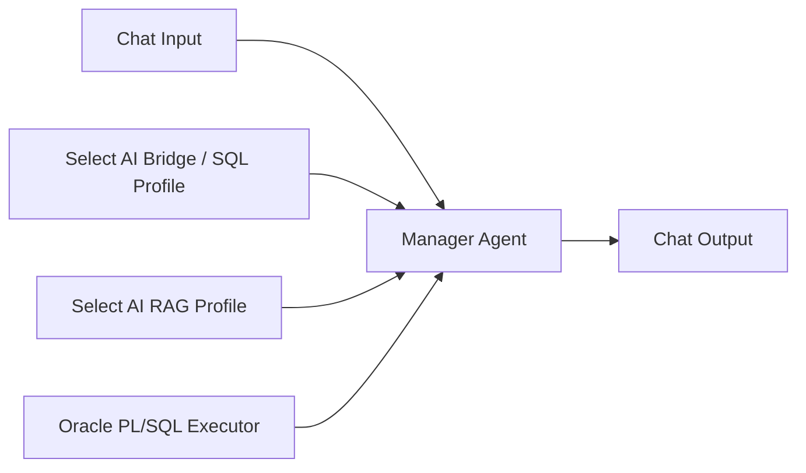

# Agent Builder構成

## 推奨設定

- Temperature: 0.1 - 0.2
- SQL Object List: Agent向けViewだけを登録
- RAG Source: `documents/pdf_ascii/`のObject Storage prefix
- Chunk Size: 900 - 1200文字から検証開始
- Chunk Overlap: 100 - 180文字
- Match Limit: 6
- Source Offsets: 有効
- PL/SQL: `CREATE_LSF_IMPROVEMENT_TASK`だけ許可
