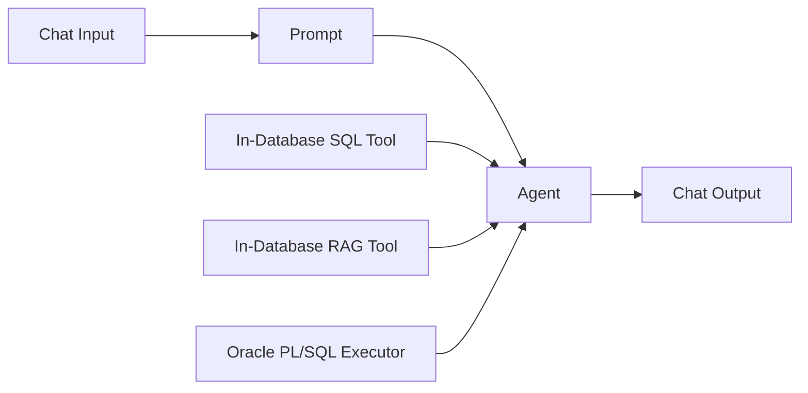

# Autonomous AI Lakehouse × Private Agent Factoryで音楽フェス運営分析Agentを作ってみてみた

音楽フェスティバルでは、チケット販売、入場ゲート、ステージ進行、DJ機器、音響ネットワーク、物販、気象、払い戻しなど、多種多様なデータが発生します。

これらのデータは、CSV、Parquet、JSON Lines、PDFなど複数の形式に分かれているため、原因調査の際には複数のシステムや文書を横断して確認する必要があります。

Autonomous AI Lakehouseでは、Object Storage上のParquetやCSVなどのデータをSQLで分析できます。また、Private Agent Factoryでは、SQL Tool、RAG Tool、Oracle PL/SQL ExecutorなどをAgent Builderから組み合わせ、企業データを利用するAI Agentを構築できます。

今回は、架空の音楽フェスティバル「Lakehouse Sound Festival 2026」を題材として、次のデータを横断する運営分析Agentを作成します。

- ステージ進行実績
- DJ機器と音響ネットワークのセンサーログ
- QR入場ログ
- チケット販売
- 物販売上と在庫
- 気象観測
- 払戻申請
- インシデント報告書や運用手順書

ということで Autonomous AI LakehouseとPrivate Agent Factoryを使用して、Lakehouse Sound Festival 2026 運営分析Agentを作ってみてみます。

> [!NOTE]
> 本記事で使用するイベント、企業、出演者、機器、障害、売上、来場者、文書はすべて架空です。Internet上のデータや実在製品の情報は含みません。

# ■ 今回作成するもの

今回作成するAgentは、自然言語の質問を受け取り、質問内容に応じてSQLとRAGを使い分けます。

```text
利用者
  |
  v
Private Agent Factory / Agent Builder
  |
  +-- SQL Tool
  |     |
  |     +-- Autonomous AI Lakehouse
  |            |
  |            +-- Object Storage上のParquet / CSV
  |
  +-- RAG Tool
  |     |
  |     +-- Select AI Vector Index
  |            |
  |            +-- Object Storage上のPDF
  |
  +-- Oracle PL/SQL Executor
        |
        +-- 承認済みの改善タスク登録プロシージャ
```

Agentには、次のような質問をします。

```text
Waveform Arenaで発生した公演遅延について、
公演実績、機器センサー、保守履歴、インシデント報告書、
サービス情報を確認し、原因と再発防止策をまとめてください。
```

この質問へ回答するには、SQLだけでもPDFだけでも不足します。

SQLからは遅延時間、機器温度、パケットロス、ファン回転数、保守期限超過を取得し、PDFからは対象製造ロットの既知の問題、正式なフェイルオーバー手順、インシデント調査結果を取得します。

# ■ 検証環境

本記事では、以下を前提とします。

| 項目 | 内容 |
|---|---|
| データ基盤 | Autonomous AI Lakehouse |
| オブジェクトストレージ | OCI Object Storage |
| Agent基盤 | Oracle AI Database Private Agent Factory 26.4 |
| Agent作成 | Agent Builder |
| 構造化データ分析 | Select AI / SQL Tool |
| 文書検索 | Select AI Vector Index / RAG Tool |
| アクション | Oracle PL/SQL Executor |
| LLM | OCI Generative AIの利用可能なモデル |
| Embedding | OCI Generative AIの利用可能なEmbedding Model |
| データ期間 | 2026年8月7日～2026年8月9日 |
| タイムゾーン | Asia/Tokyo |

Private Agent Factoryやモデルの画面項目は、リリースやリージョンによって変わる可能性があります。本記事ではPrivate Agent Factory 26.4の画面とドキュメントを基準にしています。

# ■ Lakehouse Sound Festival 2026

## ● フェスティバル概要

```text
イベント名：Lakehouse Sound Festival 2026
会場：NeoTone Bay Park
開催地：Yokohama
開催日：2026年8月7日～2026年8月9日
ステージ数：5
出演者数：36
来場者マスター：20,000
チケット販売：20,800件
```

ステージは、ライブ、DJ、DTM、クラブの異なる運用形態を持たせています。

| Stage ID | ステージ | 種別 | 収容人数 | 特徴 |
|---|---|---|---:|---|
| STG-OM | Orbit Main Stage | OUTDOOR_MAIN | 12,000 | 大型屋外ステージ |
| STG-WA | Waveform Arena | SEMI_INDOOR_DJ | 8,000 | DJリンクネットワークを使用 |
| STG-NG | Neon Groove Stage | OUTDOOR_DJ | 5,000 | 屋外DJステージ |
| STG-MG | Modular Garden | OUTDOOR_DTM | 3,500 | Modular Synth・DTMライブ |
| STG-NP | Night Pulse Club | INDOOR_CLUB | 2,500 | 屋内クラブステージ |

DJブースには、完全架空のDJ機器を配置しています。

```text
DJ Player：NeoTone PulseDeck M9
DJ Mixer：NeoTone CrossFlow MX8
Network Switch：PulseGrid StageLink 48
Digital Console：BrightLine Matrix 96
Amplifier：BrightLine PowerCore 12
```

## ● 仕込んだ4つの問題

データには、Agentが発見すべき4つの問題を意図的に組み込んでいます。

| No. | 問題 | SQLで確認する情報 | PDFで確認する情報 |
|---:|---|---|---|
| 1 | Waveform ArenaのDJリンク障害 | 公演遅延、温度、パケットロス、ファン回転数、保守期限 | 対象ロットの既知障害、根本原因、切替手順 |
| 2 | Gate CのQR読取障害 | 読取失敗率、待ち時間、切替時刻 | ファームウェア既知問題、5分以内の切替基準 |
| 3 | Lunar Echo物販の在庫切れ | 販売数、在庫推移、需要予測、Feedback | 会議で予測を採用しなかった経緯 |
| 4 | 悪天候による公演中止 | 気象、入場、公演状態、払戻申請 | 中止基準、チケット別払戻条件 |

## ● 正解となる主要数値

| シナリオ | 期待値 |
|---|---:|
| Waveform Arena最大遅延 | 29分 |
| 影響公演 | 3公演 |
| スイッチ最大温度 | 91.8 C |
| 最大パケットロス | 19.2% |
| 最低ファン回転数 | 120 RPM |
| 保守期限超過 | 14日 |
| Gate C障害時間帯の失敗率 | 61.4% |
| Gate C平均待ち時間 | 29.6分 |
| 切替基準成立から実切替まで | 16分 |
| Lunar Echo Hoodie完売 | 2026-08-08 17:40:00 JST |
| 物販計画数 | 420着 |
| 関心シグナル反映後予測 | 690着 |
| ネガティブFeedback | 250件 |
| 自動払戻承認 | 1,300件 |
| 自動承認総額 | 5,126,000円 |

この正解値は、`validation/expected_metrics.json`および`validation/expected_results.xlsx`にも格納しています。

# ■ テストデータ

## ● データ量

今回のデータセットは、CSV確認版、Parquet版、JSON Lines、PDFを含みます。

| データ | 件数／ファイル数 |
|---|---:|
| 全レコード | 137,535件 |
| チケット販売 | 20,800件 |
| 入場ログ | 37,625件 |
| 機器センサーログ | 36,975件 |
| 物販売上 | 12,320件 |
| 払戻申請 | 1,500件 |
| 来場者Feedback | 5,000件 |
| 現場Action Log | 196件 |
| Parquet | 21ファイル |
| RAG文書 | 10 PDF |

## ● ディレクトリ構成

```text
lakehouse_sound_festival_2026/
├── README.md
├── data/
│   ├── csv/
│   │   ├── master/
│   │   └── transactions/
│   ├── parquet/
│   │   ├── admission_logs/year=2026/month=08/day=07/
│   │   ├── equipment_sensor_logs/year=2026/month=08/day=08/
│   │   ├── merchandise_sales/year=2026/month=08/day=08/
│   │   └── ...
│   └── jsonl/
├── documents/
│   ├── pdf/
│   └── source/
├── sql/
├── agent/
├── metadata/
├── validation/
├── diagrams/
├── scripts/
└── generator/
```

トランザクション系データはParquetを中心にし、入場ログ、機器センサー、物販売上、在庫、気象などは日付ディレクトリへ分割しています。

CSV版も同梱しているため、データを目視確認したり、初期検証時にCSV外部表へ切り替えたりできます。

## ● 主要データ

| ファイル | 形式 | 内容 |
|---|---|---|
| `ticket_sales` | Parquet / CSV | チケット購入、種別、金額 |
| `admission_logs` | Parquet / CSV | QR読取結果、ゲート、待ち時間 |
| `performance_schedule` | Parquet / CSV | 公演予定 |
| `performance_actual` | Parquet / CSV | 実績開始・終了、遅延、状態 |
| `equipment_sensor_logs` | Parquet / CSV | 温度、ファン、パケットロスなど |
| `equipment_maintenance` | Parquet / CSV | 保守予定、完了状態 |
| `incidents` | Parquet / CSV | インシデント概要 |
| `merchandise_sales` | Parquet / CSV | 商品販売実績 |
| `inventory_snapshots` | Parquet / CSV | 時点在庫 |
| `merch_inventory_plan` | CSV | 基準予測と関心反映後予測 |
| `weather_observations` | Parquet / CSV | 雷距離、風速、降雨量 |
| `refund_requests` | Parquet / CSV | 払戻申請 |
| `attendee_feedback` | JSONL | 来場者の自由記述 |
| `staff_action_logs` | JSONL | 現場Actionの時系列 |

## ● RAG文書

Object Storageへ配置するPDFは、すべて検索可能なテキストPDFです。

```text
LSF2026_運営統括マニュアル_v1.3.pdf
LSF2026_ステージ音響ネットワーク運用手順_v2.1.pdf
LSF2026_入場ゲート障害対応手順_v1.2.pdf
LSF2026_チケット払戻ポリシー_v2.0.pdf
LSF2026_悪天候対応計画_v1.4.pdf
IR-2026-081_Waveform_Arena遅延報告.pdf
SB-NW-2603_ネットワークスイッチ冷却ファン通知.pdf
IR-2026-084_Gate_C混雑報告.pdf
LSF2026_物販売上在庫計画会議議事録.pdf
LSF2026_改善タスク登録手順.pdf
```

文書には、Document ID、Version、Effective Date、対象機器、閾値、改訂履歴などを付与しています。

例えば、Waveform Arenaの原因調査では次の2文書が重要です。

```text
IR-2026-081
  - 実際に発生した遅延とセンサー値
  - 保守未完了
  - 根本原因

SB-NW-2603
  - 対象製造ロット
  - 冷却ファン制御基板の既知問題
  - 高負荷イベントで使用してはいけない条件
```

# ■ Object Storageへ配置

## ● Bucket内の配置

Object Storageでは、次のPrefixを使用します。

```text
lakehouse_sound_festival_2026/
├── data/
│   ├── csv/
│   ├── parquet/
│   └── jsonl/
├── documents/
│   └── pdf/
└── metadata/
    ├── document_catalog.csv
    └── business_terms.csv
```

`validation/`には正解データが含まれるため、Agentの検索対象にはしません。

## ● OCI CLIでアップロード

添付ファイルには、入力データだけをアップロードするスクリプトを含めています。

```bash
export OCI_NAMESPACE='<namespace>'
export OCI_BUCKET='<bucket-name>'
export OCI_REGION='<region>'

chmod +x scripts/upload_to_object_storage.sh
./scripts/upload_to_object_storage.sh
```

`generator/`、`validation/`、`blog/`などはアップロード対象外です。

> [!TIP]
> OCI Consoleから手動でアップロードしても問題ありません。Object名はSQLファイルのURIと一致させます。

# ■ Autonomous AI Lakehouseの準備

## ● Object Storage Credentialを作成

`sql/00_variables.sql`の値を環境に合わせて変更します。

```sql
DEFINE CRED_NAME = 'LSF_OBJ_CRED';
DEFINE OBJ_URI = 'https://objectstorage.<region>.oraclecloud.com/n/<namespace>/b/<bucket>/o/lakehouse_sound_festival_2026';
DEFINE AGENT_SCHEMA = 'LSF_AGENT';
```

Auth Tokenを使用する例です。

```sql
BEGIN
  DBMS_CLOUD.CREATE_CREDENTIAL(
    credential_name => '&CRED_NAME',
    username        => '<oci-user-name>',
    password        => '<auth-token>'
  );
END;
/
```

Resource Principalを使用する場合は、Autonomous AI Database側のDynamic Group、Policy、Credential設定を環境に合わせて実施します。

## ● Parquet外部表を作成

Autonomous AI Lakehouseでは、`DBMS_CLOUD.CREATE_EXTERNAL_TABLE`を使用してObject Storage上のParquetを外部表として参照できます。

次は入場ログの例です。

```sql
BEGIN
  DBMS_CLOUD.CREATE_EXTERNAL_TABLE(
    table_name      => 'EXT_ADMISSION_LOGS',
    credential_name => '&CRED_NAME',
    file_uri_list   =>
         '&OBJ_URI/data/parquet/admission_logs/year=2026/month=08/day=07/part-000.parquet,' ||
         '&OBJ_URI/data/parquet/admission_logs/year=2026/month=08/day=08/part-000.parquet,' ||
         '&OBJ_URI/data/parquet/admission_logs/year=2026/month=08/day=09/part-000.parquet',
    format          => '{"type":"parquet","schema":"first"}'
  );
END;
/
```

全外部表は次のSQLにまとめています。

```text
sql/02_create_parquet_external_tables.sql
sql/03_create_csv_external_tables.sql
```

## ● 外部表を確認

```sql
SELECT COUNT(*) FROM EXT_TICKET_SALES;
SELECT COUNT(*) FROM EXT_ADMISSION_LOGS;
SELECT COUNT(*) FROM EXT_EQUIPMENT_SENSOR_LOGS;
SELECT COUNT(*) FROM EXT_MERCHANDISE_SALES;
SELECT COUNT(*) FROM EXT_REFUND_REQUESTS;
```

期待値は次のとおりです。

| External Table | Expected Rows |
|---|---:|
| EXT_TICKET_SALES | 20,800 |
| EXT_ADMISSION_LOGS | 37,625 |
| EXT_EQUIPMENT_SENSOR_LOGS | 36,975 |
| EXT_MERCHANDISE_SALES | 12,320 |
| EXT_REFUND_REQUESTS | 1,500 |

# ■ Agent向けViewを作成

NL2SQLへ多数の生データを直接公開するのではなく、質問意図に合わせたViewを作成します。

```text
V_STAGE_DELAY_ANALYSIS
V_EQUIPMENT_HEALTH_SUMMARY
V_GATE_CONGESTION_ANALYSIS
V_MERCH_STOCKOUT_ANALYSIS
V_REFUND_REQUEST_CONTEXT
```

## ● 公演遅延View

```sql
CREATE OR REPLACE VIEW V_STAGE_DELAY_ANALYSIS AS
SELECT
  s.festival_date,
  s.stage_id,
  st.stage_name,
  s.performance_id,
  s.artist_name,
  s.planned_start_ts,
  a.actual_start_ts,
  a.delay_minutes,
  a.status,
  a.incident_id
FROM ext_performance_schedule s
JOIN ext_performance_actual a
  ON a.performance_id = s.performance_id
LEFT JOIN ext_stages st
  ON st.stage_id = s.stage_id;
```

## ● 機器状態View

```sql
CREATE OR REPLACE VIEW V_EQUIPMENT_HEALTH_SUMMARY AS
SELECT
  festival_date,
  stage_id,
  equipment_id,
  metric_name,
  ROUND(AVG(metric_value), 3) AS avg_metric_value,
  ROUND(MIN(metric_value), 3) AS min_metric_value,
  ROUND(MAX(metric_value), 3) AS max_metric_value,
  SUM(
    CASE WHEN status IN ('WARNING','CRITICAL') THEN 1 ELSE 0 END
  ) AS abnormal_event_count
FROM ext_equipment_sensor_logs
GROUP BY
  festival_date,
  stage_id,
  equipment_id,
  metric_name;
```

## ● Viewを使う理由

Agent向けViewには次の利点があります。

- 複雑なJoinを毎回生成させなくてよい
- 遅延時間や払戻判定などの業務定義を固定できる
- 公開対象の列を限定できる
- SELECT可能な範囲を権限で制御できる
- Table CommentやColumn Commentで意味を補足できる
- 生成SQLを人間が確認しやすい

生の来場者マスターは、Agent用Object Listへ追加しません。

# ■ Private Agent Factoryの準備

## ● Database Data Sourceを登録

Private Agent FactoryからAutonomous AI Lakehouseへ接続するDatabase Data Sourceを作成します。

設定する主な項目は次のとおりです。

```text
Data Source Name：LSF2026 Autonomous AI Lakehouse
Database User：Agent用ユーザー
Connection String：Autonomous AI Lakehouseの接続文字列
Wallet：必要な接続方式の場合に登録
```

Agent用ユーザーには、分析用Viewと必要最小限の表だけを公開します。

```sql
GRANT SELECT ON V_STAGE_DELAY_ANALYSIS TO LSF_AGENT;
GRANT SELECT ON V_EQUIPMENT_HEALTH_SUMMARY TO LSF_AGENT;
GRANT SELECT ON V_GATE_CONGESTION_ANALYSIS TO LSF_AGENT;
GRANT SELECT ON V_MERCH_STOCKOUT_ANALYSIS TO LSF_AGENT;
GRANT SELECT ON V_REFUND_REQUEST_CONTEXT TO LSF_AGENT;
GRANT SELECT ON EXT_INCIDENTS TO LSF_AGENT;
GRANT SELECT ON EXT_WEATHER_OBSERVATIONS TO LSF_AGENT;
```

> [!WARNING]
> パスワード、Wallet、Private Key、Auth Tokenはブログや配布データへ含めません。

# ■ Select AIを設定

Private Agent Factory 26.4では、左側メニューのSelect AI FrameworkからCredential、Profile、Vector Indexを構成できます。

## ● Credential

OCI Generative AIを利用する場合は、OCI Provider用Credentialを作成します。

```text
Credential Name：LSF_OCI_GENAI_CRED
Provider：OCI
User OCID：<user-ocid>
Tenancy OCID：<tenancy-ocid>
Fingerprint：<fingerprint>
Private Key：<private-key>
```

作成前にValidate Credentialを実行します。

## ● Vector Index

RAG文書のObject Storage Prefixを指定してVector Indexを作成します。

```text
Vector Index Name：LSF2026_DOCS_VI
Profile Name：Embedding用Profile
Vector DB Provider：Oracle
Object Storage Location：
  https://objectstorage.<region>.oraclecloud.com/n/<namespace>/b/<bucket>/o/lakehouse_sound_festival_2026/documents/pdf/
Storage Credential Name：Object Storage読取用Credential
Chunk Size：800
Chunk Overlap：120
Match Limit：8
Distance Metric：Cosine
```

Chunk SizeとChunk Overlapは初期値です。文書の構造やEmbedding Modelに合わせて調整します。

文書では「Document ID」「閾値」「Root Cause」「改訂履歴」などの見出しを明確にしているため、文書単位と節単位の検索結果を確認しやすくしています。

## ● Select AI Profile

SQLとRAGを使用するProfileを作成します。

```text
Profile Name：LSF2026_AGENT_PROFILE
Provider Name：OCI
Credential Name：LSF_OCI_GENAI_CRED
Region：<region>
Model：<利用するLLM>
Embedding Model：<利用するEmbedding Model>
Temperature：0.1
Enable NL2SQL：ON
Enable RAG：ON
Vector Index Name：LSF2026_DOCS_VI
Source Offsets：ON
Enforce Object List：ON
```

NL2SQLで選択するObjectは、次のみにします。

```text
V_STAGE_DELAY_ANALYSIS
V_EQUIPMENT_HEALTH_SUMMARY
V_GATE_CONGESTION_ANALYSIS
V_MERCH_STOCKOUT_ANALYSIS
V_REFUND_REQUEST_CONTEXT
EXT_INCIDENTS
EXT_WEATHER_OBSERVATIONS
```

`Enforce Object List`を有効化し、選択していない表を生成SQLの対象外にします。

# ■ Agent BuilderでWorkflowを作成

## ● Workflow構成

Agent Builderでは、次のようにNodeを配置します。



SQL ToolとRAG Toolは、先ほど作成したDatabase Data SourceとSelect AI Profileへ接続します。

Oracle PL/SQL Executorには、次のプロシージャだけを公開します。

```text
CREATE_LSF_IMPROVEMENT_TASK
```

## ● System Prompt

添付ファイルの`agent/system_prompt.md`をPrompt NodeまたはAgent Instructionsへ設定します。

主要部分は次のとおりです。

```text
あなたはLakehouse Sound Festival 2026の運営分析Agentです。

数値、件数、割合、時刻、期間比較、異常検知に関する質問では、
SQL Toolを使用してください。

運用基準、閾値、根本原因、既知問題、正式な手順、
払戻条件に関する質問では、RAG Toolを使用してください。

原因を説明するときは、SQL結果だけで断定しないでください。
関連するインシデント報告書、運用手順、サービス情報を検索し、
確認済み事実と推測を分けてください。

データ更新を伴うToolは、利用者へ登録内容を提示し、
明示的な承認を受けた後にのみ実行してください。
```

## ● Tool Description

Tool Descriptionには、いつ使用するToolなのかを明確に記載します。

SQL Tool：

```text
フェスティバルの公演、入場、機器、物販、気象、払戻に関する
数値事実を取得する。運用規程や根本原因を回答するためのToolではない。
```

RAG Tool：

```text
運用マニュアル、インシデント報告、サービス情報、
払戻ポリシー、会議議事録から根拠を取得する。
件数や集計値はSQL Toolで確認する。
```

PL/SQL Tool：

```text
分析結果に基づく改善タスクを登録する。
利用者の明示的な承認前には実行しない。
```

# ■ 動作確認

テスト質問は`agent/test_questions.md`へまとめています。

## ● SQLだけを使用する質問

```text
ステージごとの最大遅延時間を、遅延が大きい順に表示してください。
```

期待結果では、Waveform Arenaの最大遅延が29分になります。

確認する内容は次のとおりです。

- SQL Toolが選択されたか
- `V_STAGE_DELAY_ANALYSIS`が使用されたか
- 並び順が正しいか
- 生成SQLに対象外表が含まれていないか

## ● RAGだけを使用する質問

```text
DJリンクネットワークでパケットロスが5%を超えた場合の
正式な対応手順を教えてください。
```

期待する内容は次のとおりです。

```text
- 5%超が2分継続するとCritical
- 主系を隔離し予備系へ切り替える
- 5分以内の切替を目標とする
- 切替後に2台以上のDJプレイヤーで同期、波形、音声を確認する
- 復旧した主系機器は再利用せず隔離する
```

参照文書として`OPS-NET-2.1`が示されることを確認します。

## ● SQLとRAGを組み合わせる質問

```text
Waveform Arenaで発生した公演遅延について、
公演実績、機器センサー、保守履歴、インシデント報告書、
サービス情報を確認し、原因と再発防止策をまとめてください。
```

期待する分析結果です。

```text
影響：3公演
最大遅延：29分
最大温度：91.8 C
最大パケットロス：19.2%
最低ファン回転数：120 RPM
保守期限超過：14日

直接原因：
製造ロットNW-2603の冷却ファン制御基板問題

寄与要因：
交換部品の到着遅延を理由に、期限超過の保守を未完了のまま
本番構成へ投入したこと

原因ではないもの：
DJプレイヤー本体、楽曲ファイル、アーティストのUSBメディア

参照文書：
IR-2026-081
SB-NW-2603
OPS-NET-2.1
```

この回答は、数値だけで「DJプレイヤー故障」と誤認しない点が重要です。

## ● Gate Cを分析

```text
Gate Cで混雑が発生した原因を、読取ログと運用手順から分析してください。
技術原因と運用原因を分けてください。
```

期待する結果です。

```text
技術原因：Firmware 1.8.2の高輝度QR処理問題
失敗率：61.4%
平均待ち時間：29.6分

運用原因：
切替基準成立後5分以内に切り替える必要があったが、
実際には16分かかった
```

## ● 物販を分析

```text
Lunar Echo Signal Hoodieが完売した原因を、
在庫計画、販売実績、関心シグナル、会議議事録から説明してください。
```

期待する結果です。

```text
完売時刻：2026-08-08 17:40:00 JST
販売数：420着
計画在庫：420着
関心シグナル反映後予測：690着
計画不足率：39.1%
ネガティブFeedback：250件

原因：
Wishlist、SNS Mention、Preorder Clickによる需要増加が
在庫計画へ反映されなかった
```

## ● 払戻を分析

```text
3日目の悪天候中止について、払戻対象件数と総額を算出し、
適用した条件を文書から説明してください。
```

期待する結果です。

```text
自動承認：1,300件
自動承認総額：5,126,000円
手動確認：30件
否認：170件
```

払い戻しは申請理由だけで判定せず、チケット種別、購入金額、対象日のSUCCESS入場記録、公演状態、悪天候インシデント継続時間を組み合わせます。

# ■ 承認付きアクションを実行

## ● PL/SQLプロシージャ

改善タスク登録用に、次のプロシージャを用意しています。

```text
CREATE_LSF_IMPROVEMENT_TASK
```

Agentへ次のように質問します。

```text
Waveform Arenaの再発防止として、
予防保守期限を超過したネットワーク機器を本番構成へ投入できないようにする
High Priorityの改善タスクを作成してください。
```

Agentは即時登録せず、次のような案を表示します。

```text
Incident ID：IR-2026-081
Title：予防保守期限超過機器の本番投入防止
Priority：HIGH
Owner Team：TEAM-NOC
Description：保守期限を超過したCRITICAL機器を...

この内容で登録してよろしいですか。
```

利用者が明示的に承認した後だけ、Oracle PL/SQL Executorから登録します。

Private Agent FactoryのOracle PL/SQL Executorは、接続先Databaseのメタデータから選択したプロシージャやファンクションをToolとして公開する仕組みです。LLMが任意のPL/SQL文字列を自由に実行する構成にはしません。

# ■ Traceと回答根拠を確認

Agentの回答だけでなく、実行Traceも確認します。

確認項目は次のとおりです。

- どのToolを選択したか
- SQL Toolで生成されたSQL
- SQL実行結果
- RAGで取得したDocument ID
- Source Offset
- Agentが最終回答へ統合した根拠
- PL/SQL Toolが承認前に呼ばれていないか
- 実行時間とエラー

回答フォーマットは、次のように統一します。

```text
1. 結論
2. 数値的根拠
3. 文書上の根拠
4. 原因分類
5. 改善案
6. 不確実な点
7. 参照ソース
```

# ■ セキュリティとガードレール

## ● Object Listを限定

NL2SQLへ公開するObjectは、Agent向けViewと必要な外部表だけにします。

`Enforce Object List`を有効化し、来場者マスターや管理表を対象外にします。

## ● Database権限を分離

- 外部表・View所有者
- Agent読取ユーザー
- Select AI設定ユーザー
- アクション実行ユーザー

検証環境ではまとめることもできますが、記事内では役割を分けて説明した方が本番設計へつながります。

## ● 正解データをAgentへ公開しない

次のディレクトリはAgentのRAG対象外です。

```text
validation/
generator/
blog/
```

特に`validation/expected_findings.md`を取り込むと、Agentが分析せずに正解を検索できてしまいます。

## ● 文書の有効日を確認

RAGでは、類似度だけでなく次の情報を回答へ含めます。

- Document ID
- Version
- Effective Date
- 適用対象
- 該当箇所

今後、旧版文書を混在させる場合は、質問対象日時に有効な文書を優先する指示も必要です。

## ● 更新処理は承認済みToolだけにする

改善タスク登録などの更新処理は、任意SQLではなく、引数と業務処理を限定したプロシージャとして公開します。

# ■ Autonomous AI Lakehouseらしさ

今回の構成では、Database内へすべての明細をロードせず、Object Storage上のParquetを外部表として参照します。

また、次の異なるデータ形式を一つの分析へ統合しています。

```text
Parquet：入場、センサー、販売、在庫、気象、払戻
CSV：マスター、計画、確認用トランザクション
JSONL：自由記述Feedback、現場Action Log
PDF：手順、ポリシー、報告書、サービス情報、議事録
```

さらにデータ量を増やす場合は、次の発展も考えられます。

- 日付・ステージ・ゲート単位のPartition追加
- Iceberg Tableへの変更
- Lake Cacheによる反復クエリ高速化
- Data Lake Acceleratorを使用した大規模スキャン
- AI EnrichmentによるFeedback分類
- 複数年のフェスデータ比較
- ストリーミングデータを加えたリアルタイム運営Agent

# ■ 作成したデータから分かったこと

## ● SQLとRAGの責務を分ける

「何件発生したか」「最大値はいくつか」はSQLが得意です。

一方、「なぜ発生したか」「正式な対応基準は何か」「例外条件は何か」は文書検索が必要です。

AgentのInstructionsとTool Descriptionでこの役割を明確にすると、不要なTool呼出しや根拠の弱い断定を減らせます。

## ● 意味のある合成データが重要

完全な乱数データでは、Agentが何を発見しても正解を判断できません。

今回は、次のようにすべての証拠を一致させています。

```text
センサーログの異常時刻
    = インシデント報告書のTimeline

機器マスターの製造ロット
    = サービス情報の対象ロット

保守履歴の未完了
    = Root Causeの寄与要因

在庫計画と関心予測の差
    = 会議議事録の未採用判断

入場記録とTicket Type
    = 払戻ポリシーの判定条件
```

この整合性があることで、Agentの回答を定量的に評価できます。

## ● 生表よりAgent向けViewが安定する

業務ルールをViewへ集約すると、生成SQLが短くなり、質問ごとの揺らぎも減ります。

ただし、Viewの定義が誤っていればAgentも誤るため、`sql/07_validation_queries.sql`と`validation/expected_results.xlsx`で確認します。

## ● Human-in-the-loopはPromptだけに依存しない

Promptで「承認を得る」と指示するだけでなく、公開するTool自体を限定します。

分析は読取専用、更新は承認済みプロシージャという境界を作ることが重要です。

# ■ まとめ

Autonomous AI LakehouseとPrivate Agent Factoryを組み合わせて、音楽フェスティバルの構造化データと業務文書を横断する運営分析Agentを作成しました。

Object Storage上のParquetをSQLで分析し、PDFをRAG検索することで、次の問題を一つのAgentから調査できました。

- DJリンクネットワーク障害による公演遅延
- QR読取障害とフェイルオーバー遅延
- 需要シグナル未反映による物販在庫切れ
- 悪天候による公演中止と払戻判定

また、Object List、読取専用権限、Source Offset、承認済みPL/SQL Toolを使用することで、回答根拠とアクション範囲を制御できます。

今回は約137,535件の完全合成データを使用しましたが、同じ生成ロジックで期間やデータ量を増やし、Iceberg、Lake Cache、Data Lake Acceleratorなどを含む検証へ拡張できそうです。

# ■ 参考資料

- [Private Agent Factory - Oracle](https://www.oracle.com/database/agent-factory/)
- [Autonomous AI Lakehouse](https://docs.oracle.com/en/cloud/paas/autonomous-database/serverless/adbsb/autonomous-lakehouse.html)
- [Query External Data with ORC, Parquet, or Avro Source Files](https://docs.oracle.com/en-us/iaas/autonomous-database-serverless/doc/query-external-parquet-avro.html)
- [Configure Select AI for Your Database](https://docs.oracle.com/en/database/oracle/agent-factory/26.4/paias/select-ai.html)
- [Components in an Agent Builder](https://docs.oracle.com/en/database/oracle/agent-factory/26.4/paias/agent-builder-components.html)
- [Data Analysis Agents](https://docs.oracle.com/en/database/oracle/agent-factory/26.4/paias/create-data-analysis-agent.html)
- [Private Agent Factoryの紹介](https://blogs.oracle.com/oracle4engineer/ja-intro-private-agent-factory)

# ■ スクリーンショット候補

記事作成時には、次の画面を追加すると流れが分かりやすくなります。

1. Object StorageのPrefix構成
2. Parquet外部表の件数確認
3. Waveform Arenaの遅延分析SQL結果
4. センサーログの最大温度とパケットロス
5. Private Agent FactoryのDatabase Data Source
6. Select AI Credential
7. Vector IndexのObject Storage Location
8. Select AI ProfileのObject List
9. Enforce Object ListとSource Offsets
10. Agent Builder全体Canvas
11. SQL Toolの実行Trace
12. RAGのDocument IDと引用箇所
13. SQL＋RAGを統合した回答
14. PL/SQL実行前の承認確認
15. 改善タスク登録後のTask ID
